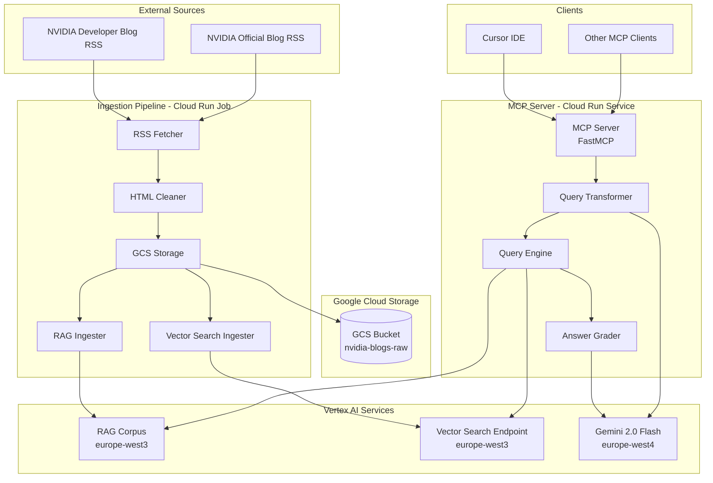
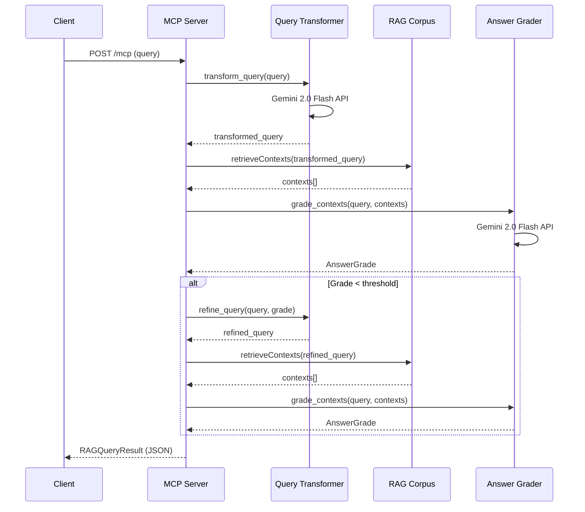

# NVIDIA Blog MCP System Architecture

## Overview

The NVIDIA Blog MCP (Model Context Protocol) server is a production-ready system that provides AI assistants with grounded access to NVIDIA's official developer and blog content through Retrieval-Augmented Generation (RAG). The system consists of two main components:

1. **Ingestion Pipeline**: A Cloud Run Job that fetches, processes, and indexes blog content
2. **MCP Server**: A Cloud Run Service that provides query access via the MCP protocol

## High-Level Architecture



## Data Flow

### Ingestion Flow

1. **RSS Feed Collection** (`private/rss_fetcher.py`)
   - Fetches RSS feeds from NVIDIA Developer Blog and Official Blog
   - Parses XML to extract item metadata (title, link, guid, pubDate)
   - Detects new items by comparing against processed IDs stored in GCS

2. **HTML Content Fetching** (`private/rss_fetcher.py`)
   - Downloads full HTML content for each new article
   - Uses retry logic with exponential backoff for resilience

3. **HTML Cleaning** (`private/html_cleaner.py`)
   - Removes scripts, styles, ads, navigation, footers
   - Extracts main article content using semantic selectors
   - Prepends metadata header (publication date, title, source)
   - Cleans whitespace and removes footer patterns

4. **Storage** (`private/gcs_utils.py`)
   - Saves raw XML to `{folder}/raw_xml/{item_id}.xml`
   - Saves raw HTML to `{folder}/raw_html/{item_id}.html`
   - Saves cleaned text to `{folder}/clean/{item_id}.txt`
   - Maintains `processed_ids.json` for deduplication

5. **RAG Corpus Ingestion** (`private/rag_ingest.py`)
   - References cleaned text files via GCS URIs
   - Configures chunking: 768 words per chunk, 128 words overlap (~17%)
   - Uses REST API to import files (Python SDK RAG module not available)
   - Polls Long Running Operations (LRO) until completion
   - Handles concurrent operation conflicts with retry logic

6. **Vector Search Ingestion** (`private/vector_search_ingest.py`)
   - Generates 768-dimensional embeddings using `text-multilingual-embedding-002`
   - Upserts vectors to Vector Search index with document metadata
   - Optional component - ingestion continues if Vector Search fails

### Query Flow

1. **MCP Request** (`mcp/mcp_server.py`)
   - Receives query via FastMCP's streamable HTTP endpoint (`/mcp`)
   - Validates input parameters (query text, method, top_k)

2. **Query Transformation** (`mcp/rag_query_transformer.py`)
   - Uses Gemini 2.0 Flash to rewrite weak/vague queries
   - Expands abbreviations, adds technical context
   - Handles temporal queries with date awareness
   - Runs in `europe-west4` region (closest to RAG corpus)

3. **Context Retrieval** (`mcp/query_rag.py`)
   - Queries RAG Corpus via REST API with transformed query
   - Retrieves top-k contexts (default: 10) with similarity scores
   - Normalizes field names (handles API response variations)
   - Filters out header-only chunks (< 100 chars after header removal)

4. **Answer Grading** (`mcp/rag_answer_grader.py`)
   - Evaluates retrieved contexts for quality
   - Scores: relevance (0.0-1.0), completeness (0.0-1.0), grounded (bool)
   - Determines if query refinement is needed
   - Uses Gemini 2.0 Flash for evaluation

5. **Iterative Refinement** (`mcp/query_rag.py`)
   - If grade is below threshold, refines query and retries
   - Up to 2 refinement iterations
   - Stores best result across iterations

6. **Response Formatting** (`mcp/mcp_server.py`)
   - Wraps results in Pydantic models for validation
   - Returns structured JSON response via MCP protocol
   - Includes metadata: transformed query, grade, refinement iterations

## Component Interaction Sequence



## Deployment Architecture

### Ingestion Pipeline (Cloud Run Job)

- **Trigger**: Scheduled daily at 7:00 AM UTC
- **Runtime**: Python 3.11 slim container
- **Resources**: Configured via Cloud Run Job settings
- **Service Account**: `cloud-run-rss-ingestor` (write access to GCS, RAG Corpus, Vector Search)

### MCP Server (Cloud Run Service)

- **Deployment**: `nvidia-blog-mcp-server`
- **Region**: `europe-west3`
- **Resources**:
  - Memory: 1Gi
  - CPU: 1
  - Timeout: 300 seconds
  - Min instances: 0 (scales to zero)
  - Max instances: 10
- **Endpoints**:
  - `POST /mcp` - MCP protocol endpoint
  - `GET /health` - Health check endpoint
  - `GET /` - Root health check
- **Authentication**: Publicly accessible (no authentication required)

### Storage Architecture

- **GCS Bucket**: `nvidia-blogs-raw`
  - Structure:
    ```
    {feed_folder}/
      ├── raw_xml/{item_id}.xml
      ├── raw_html/{item_id}.html
      ├── clean/{item_id}.txt
      └── processed_ids.json
    ```
- **RAG Corpus**: Vertex AI RAG Corpus in `europe-west3`
  - Uses `text-multilingual-embedding-002` for embeddings
  - Chunking: 768 words, 128 overlap
- **Vector Search**: Vertex AI Vector Search in `europe-west3`
  - Index ID: `1196910765810909184`
  - Endpoint ID: `8740721616633200640`
  - 768-dimensional embeddings

## Request/Response Flow

### MCP Query Request

```json
{
  "method": "tools/call",
  "params": {
    "name": "search_nvidia_blogs",
    "arguments": {
      "query": "How to optimize CUDA kernels?",
      "method": "rag",
      "top_k": 10
    }
  }
}
```

### MCP Query Response

```json
{
  "query": "How to optimize CUDA kernels?",
  "transformed_query": "CUDA kernel optimization techniques, performance tuning, GPU computing best practices",
  "contexts": [
    {
      "source_uri": "https://developer.nvidia.com/blog/...",
      "text": "...",
      "distance": 0.65
    }
  ],
  "count": 10,
  "grade": {
    "score": 0.85,
    "relevance": 0.90,
    "completeness": 0.80,
    "grounded": true,
    "reasoning": "Contexts directly address CUDA optimization...",
    "should_refine": false
  },
  "refinement_iterations": 0
}
```

## Technology Stack

### Core Technologies
- **Python 3.11**: Runtime environment
- **FastMCP**: MCP server framework
- **Starlette**: ASGI framework (via FastMCP)
- **Uvicorn**: ASGI server
- **Pydantic v2**: Data validation and serialization

### Google Cloud Platform Services
- **Cloud Run**: Container hosting (Job + Service)
- **Cloud Storage (GCS)**: Raw data storage
- **Vertex AI RAG Corpus**: Semantic search backend
- **Vertex AI Vector Search**: Vector similarity search
- **Vertex AI Gemini**: Query transformation and answer grading
- **Cloud Build**: CI/CD pipeline
- **Artifact Registry**: Docker image storage

### Python Libraries
- **google-cloud-aiplatform**: Vertex AI SDK
- **vertexai**: Vertex AI Python SDK
- **google-cloud-storage**: GCS operations
- **beautifulsoup4**: HTML parsing
- **feedparser**: RSS parsing
- **requests**: HTTP client
- **tenacity**: Retry logic

## Regional Architecture

The system uses a multi-region approach for optimal performance:

- **europe-west3 (Frankfurt)**: 
  - RAG Corpus
  - Vector Search
  - GCS Bucket
  - Cloud Run services

- **europe-west4 (Netherlands)**:
  - Gemini 2.0 Flash models (query transformation, answer grading)
  - Chosen for proximity to europe-west3 while meeting Gemini availability requirements

This regional strategy minimizes latency while ensuring data residency compliance.

## Security & Access

- **Service Accounts**: 
  - Ingestion job uses `cloud-run-rss-ingestor` with write permissions
  - MCP server uses default Cloud Run service account with read permissions
- **Authentication**: 
  - MCP endpoint is publicly accessible (no auth required)
  - GCS, Vertex AI services use service account authentication
- **Network**: 
  - Cloud Run services use Google's managed network
  - No VPC configuration required

## Scalability Considerations

- **Horizontal Scaling**: Cloud Run automatically scales MCP server (0-10 instances)
- **Cold Starts**: Min instances = 0 allows cost optimization, but may cause cold starts
- **Rate Limiting**: No explicit rate limiting configured (relies on Cloud Run defaults)
- **Concurrent Operations**: RAG ingestion handles concurrent operation conflicts with retry logic
- **Resource Limits**: 1Gi memory, 1 CPU per instance (sufficient for query processing)

