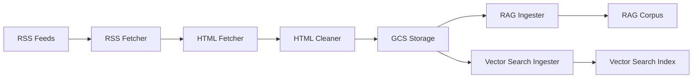

# Data Pipeline Evaluation

## Overview

The NVIDIA Blog MCP data pipeline is a robust, production-ready system that ingests blog content from RSS feeds, processes it through multiple stages, and indexes it for semantic search. This document provides a comprehensive evaluation of each pipeline stage.

## Pipeline Architecture



## Stage 1: RSS Feed Collection

**Location**: `private/rss_fetcher.py`

### Implementation

**RSS Fetcher Class** (lines 38-164)

```python
class RSSFetcher:
    def __init__(self):
        self.session = requests.Session()
        self.session.headers.update({
            "User-Agent": "Mozilla/5.0 (compatible; RSSIngestor/1.0; +https://nvidia-blog-ingestor)"
        })
```

**Key Features:**
- Persistent HTTP session for connection reuse
- Custom User-Agent for identification
- Retry logic with exponential backoff

### RSS Fetching

**Fetch Method** (lines 47-69)

```python
@retry(
    stop=stop_after_attempt(3),
    wait=wait_exponential(multiplier=1, min=2, max=10),
    retry=retry_if_exception_type((requests.RequestException, ConnectionError))
)
def fetch_rss(self, url: str) -> bytes:
    logger.info(f"Fetching RSS feed: {url}")
    response = self.session.get(url, timeout=30)
    response.raise_for_status()
    return response.content
```

**Retry Strategy:**
- **Max Attempts**: 3
- **Backoff**: Exponential (2s, 4s, 8s)
- **Timeout**: 30 seconds per attempt
- **Error Types**: RequestException, ConnectionError

**Performance:**
- **Latency**: ~200-500ms per feed (depends on network)
- **Reliability**: High (3 retries with backoff)
- **Error Handling**: Raises exception after retries exhausted

### RSS Parsing

**Parse Method** (lines 71-99)

```python
def parse_rss(self, xml_content: bytes) -> List[Dict]:
    feed = feedparser.parse(xml_content)
    
    if feed.bozo and feed.bozo_exception:
        logger.warning(f"RSS parsing warnings: {feed.bozo_exception}")
    
    items = []
    for entry in feed.entries:
        item = {
            "title": entry.get("title", "").strip(),
            "link": entry.get("link", "").strip(),
            "guid": entry.get("id", entry.get("link", "")).strip(),
            "pubDate": entry.get("published", entry.get("updated", "")).strip(),
            "description": entry.get("description", "").strip()
        }
        items.append(item)
    
    return items
```

**Parsing Features:**
- Uses `feedparser` library (handles RSS 2.0, Atom, etc.)
- Handles parsing warnings gracefully
- Extracts essential metadata (title, link, guid, pubDate, description)
- Normalizes field access (handles variations)

**Data Quality:**
- **Field Completeness**: High (most feeds provide all fields)
- **Date Parsing**: Handles multiple date formats
- **Link Validation**: Extracts from guid or link field

### New Item Detection

**Detection Method** (lines 101-123)

```python
def get_new_items(self, items: List[Dict], processed_ids: Set[str]) -> List[Dict]:
    new_items = []
    for item in items:
        raw_id = item.get("guid") or item.get("link", "")
        item_id = sanitize_item_id(raw_id)
        
        if item_id not in processed_ids:
            new_items.append(item)
    
    return new_items
```

**ID Sanitization** (lines 17-35)

```python
def sanitize_item_id(raw_id: str) -> str:
    if raw_id:
        # Sanitize ID for use in file paths
        item_id = re.sub(r'[^\w\-_\.]', '_', raw_id)[:200]  # Limit to 200 chars
        if not item_id or item_id == '_':
            item_id = f"item_{int(datetime.utcnow().timestamp())}"
        return item_id
    else:
        return f"item_{int(datetime.utcnow().timestamp())}"
```

**Sanitization Strategy:**
- Removes special characters (filesystem-safe)
- Limits length to 200 characters
- Fallback to timestamp if sanitization fails
- Ensures consistent ID format

**Deduplication:**
- Uses sanitized IDs for comparison
- Prevents duplicate processing
- Handles ID format changes gracefully

## Stage 2: HTML Content Fetching

**Location**: `private/rss_fetcher.py:125-144`

### Implementation

```python
@retry(
    stop=stop_after_attempt(3),
    wait=wait_exponential(multiplier=1, min=2, max=10),
    retry=retry_if_exception_type((requests.RequestException, ConnectionError))
)
def fetch_html(self, url: str) -> str:
    logger.info(f"Fetching HTML from: {url}")
    response = self.session.get(url, timeout=30)
    response.raise_for_status()
    response.encoding = response.apparent_encoding or 'utf-8'
    return response.text
```

**Features:**
- Same retry strategy as RSS fetching
- Encoding detection (falls back to UTF-8)
- Returns text (not bytes) for HTML parsing

**Performance:**
- **Latency**: ~500-2000ms per article (depends on page size)
- **Throughput**: Limited by network and target server
- **Error Handling**: Retries with exponential backoff

## Stage 3: HTML Cleaning

**Location**: `private/html_cleaner.py`

### Implementation

**HTML Cleaner Class** (lines 14-175)

**Initialization** (lines 17-38)

```python
class HTMLCleaner:
    def __init__(self):
        # Common selectors for content to remove
        self.remove_selectors = [
            'script', 'style', 'nav', 'header', 'footer', 'aside',
            '.advertisement', '.ad', '.ads', '.social-share',
            '.share-buttons', '.related-posts', '.comments',
            '.comment-section', '[class*="ad"]', '[class*="share"]',
            '[id*="ad"]', '[id*="share"]',
        ]
```

**Cleaning Process** (lines 40-145)

1. **Parse HTML** (line 57)
   ```python
   soup = BeautifulSoup(html, 'lxml')
   ```

2. **Remove Scripts/Styles** (lines 59-61)
   ```python
   for element in soup(['script', 'style']):
       element.decompose()
   ```

3. **Remove Comments** (lines 63-65)
   ```python
   for comment in soup.find_all(string=lambda text: isinstance(text, Comment)):
       comment.extract()
   ```

4. **Remove UI Elements** (lines 67-73)
   ```python
   for selector in self.remove_selectors:
       for element in soup.select(selector):
           element.decompose()
   ```

5. **Extract Article Content** (lines 75-105)
   ```python
   article_selectors = [
       'article', 'main', '[role="main"]',
       '.post-content', '.entry-content', '.article-content',
       '.content', '.post-body', '.article-body',
       '#content', '#main-content', '.blog-post-content',
   ]
   ```

6. **Extract Text** (line 108)
   ```python
   text = article_content.get_text(separator='\n', strip=True)
   ```

7. **Clean Whitespace** (lines 111, 147-155)
   ```python
   text = self._clean_whitespace(text)
   ```

8. **Remove Footer Patterns** (lines 114, 157-174)
   ```python
   text = self._remove_footer_header_patterns(text)
   ```

9. **Prepend Metadata** (lines 116-142)
   ```python
   if metadata:
       header = '\n'.join(header_parts) + '\n\n---\n\n'
       text = header + text
   ```

**Performance:**
- **Latency**: ~100-500ms per article (depends on HTML complexity)
- **Compression**: 80-90% size reduction (HTML → cleaned text)
- **Quality**: High (preserves article content, removes noise)

## Stage 4: GCS Storage

**Location**: `private/gcs_utils.py`

### Implementation

**GCS Manager Class** (lines 15-125)

**Initialization** (lines 18-27)

```python
class GCSManager:
    def __init__(self, bucket_name: str):
        self.bucket_name = bucket_name
        self.client = storage.Client()
        self.bucket = self.client.bucket(bucket_name)
```

**File Organization** (`private/main.py`):

```
{feed_folder}/
  ├── raw_xml/{item_id}.xml      # Original RSS item XML
  ├── raw_html/{item_id}.html     # Full HTML content
  ├── clean/{item_id}.txt         # Cleaned text
  └── processed_ids.json          # Deduplication tracking
```

**Storage Operations:**

1. **Read JSON** (lines 34-60)
   ```python
   def read_json(self, blob_path: str) -> Optional[Dict]:
       blob = self.bucket.blob(blob_path)
       if not blob.exists():
           return None
       content = blob.download_as_text()
       return json.loads(content)
   ```

2. **Write JSON** (lines 67-83)
   ```python
   def write_json(self, blob_path: str, data: Dict):
       blob = self.bucket.blob(blob_path)
       content = json.dumps(data, indent=2, ensure_ascii=False)
       blob.upload_from_string(content, content_type='application/json')
   ```

3. **Upload File** (lines 90-124)
   ```python
   def upload_file(self, blob_path: str, content: Union[str, bytes], content_type: Optional[str] = None):
       blob = self.bucket.blob(blob_path)
       
       # Auto-detect content type
       if content_type is None:
           if blob_path.endswith('.xml'):
               content_type = 'application/xml'
           # ... additional type detection ...
       
       # Convert string to bytes if needed
       if isinstance(content, str):
           content = content.encode('utf-8')
       
       blob.upload_from_string(content, content_type=content_type)
   ```

**Retry Logic:**
- All operations use tenacity retry decorator
- 3 attempts with exponential backoff
- Handles transient GCS errors

**Performance:**
- **Latency**: ~200-500ms per file (depends on size)
- **Throughput**: High (GCS handles concurrent uploads)
- **Reliability**: High (retry logic handles transient errors)

## Stage 5: RAG Corpus Ingestion

**Location**: `private/rag_ingest.py`

### Implementation

**Ingestion Process** (lines 71-224)

1. **Construct GCS URI** (line 91)
   ```python
   gcs_uri = f"gs://{self.bucket_name}/{folder}/clean/{item_id}.txt"
   ```

2. **Prepare Request** (lines 94-111)
   ```python
   request_body = {
       "import_rag_files_config": {
           "gcs_source": {"uris": [gcs_uri]},
           "rag_file_chunking_config": {
               "chunk_size": 768,
               "chunk_overlap": 128
           }
       }
   }
   ```

3. **Import via REST API** (lines 119-124)
   ```python
   response = requests.post(
       import_url,
       headers=headers,
       json=request_body,
       timeout=300
   )
   ```

4. **Poll LRO** (lines 154-219)
   ```python
   while poll_attempt < max_poll_attempts:
       # Poll operation status
       op_result = op_response.json()
       if op_result.get("done", False):
           # Extract results
           break
       time.sleep(5)
   ```

**Performance:**
- **Latency**: ~1-5 minutes per article (LRO polling)
- **Throughput**: Limited by concurrent operation handling
- **Reliability**: High (handles concurrent conflicts with retry)

## Stage 6: Vector Search Ingestion

**Location**: `private/vector_search_ingest.py`

### Implementation

**Embedding Generation** (lines 79-105)

```python
@retry(
    stop=stop_after_attempt(3),
    wait=wait_exponential(multiplier=1, min=2, max=10),
    retry=retry_if_exception_type((Exception,))
)
def embed_text(self, text: str) -> List[float]:
    embeddings = self.embedding_model.get_embeddings([text])
    if not embeddings or len(embeddings) == 0:
        raise ValueError("No embeddings returned from model")
    return embeddings[0].values  # 768 dimensions
```

**Vector Upsert** (lines 112-141)

```python
@retry(
    stop=stop_after_attempt(3),
    wait=wait_exponential(multiplier=1, min=2, max=10),
    retry=retry_if_exception_type((Exception,))
)
def upsert_vector(self, vector: List[float], doc_id: str, metadata: Dict):
    datapoint = {
        "datapoint_id": doc_id,
        "feature_vector": vector,
    }
    self.index.upsert_datapoints(datapoints=[datapoint])
```

**Performance:**
- **Embedding Latency**: ~200-500ms per article
- **Upsert Latency**: ~100-300ms per article
- **Total**: ~300-800ms per article
- **Reliability**: High (retry logic handles transient errors)

## Stage 7: Main Orchestration

**Location**: `private/main.py`

### Pipeline Flow

**Feed Processing** (lines 74-284)

```python
def process_feed(feed_name: str, feed_config: Dict, ...):
    # 1. Fetch and parse RSS
    rss_xml = rss_fetcher.fetch_rss(url)
    items = rss_fetcher.parse_rss(rss_xml)
    
    # 2. Load processed IDs
    processed_ids = gcs.read_json(processed_ids_path) or {"ids": []}
    
    # 3. Detect new items
    new_items = rss_fetcher.get_new_items(items, existing_ids)
    
    # 4. Process each new item
    for item in new_items:
        # Save raw XML
        gcs.upload_file(xml_path, rss_fetcher.get_item_xml(item))
        
        # Fetch and save HTML
        html_content = rss_fetcher.fetch_html(article_url)
        gcs.upload_file(html_path, html_content)
        
        # Clean HTML
        clean_text = html_cleaner.clean_html(html_content, metadata=metadata)
        gcs.upload_file(text_path, clean_text)
        
        # Ingest to RAG Corpus
        rag_ingester.ingest_to_rag(clean_text, metadata)
        
        # Embed and upsert to Vector Search
        if vector_ingester:
            embedding = vector_ingester.embed_text(clean_text)
            vector_ingester.upsert_vector(embedding, item_id, metadata)
        
        # Mark as processed
        new_processed_ids.append(item_id)
    
    # 5. Update processed IDs
    gcs.write_json(processed_ids_path, processed_ids)
```

**Error Handling** (lines 203-214, 238-246)

```python
# RAG ingestion errors don't stop processing
try:
    rag_ingester.ingest_to_rag(clean_text, metadata)
except Exception as e:
    log_structured("error", "RAG ingestion failed, continuing", ...)
    # Don't raise - continue processing

# Vector Search is optional
if vector_ingester:
    try:
        embedding = vector_ingester.embed_text(clean_text)
        vector_ingester.upsert_vector(embedding, item_id, metadata)
    except Exception as e:
        log_structured("warning", "Vector Search upsert failed, continuing", ...)
        # Continue processing even if vector search fails
```

**Graceful Degradation:**
- RAG ingestion failures don't stop processing
- Vector Search is optional (continues if unavailable)
- Individual item failures don't stop feed processing
- Errors are logged but don't prevent progress

**Structured Logging** (lines 63-71)

```python
def log_structured(level: str, message: str, **kwargs):
    log_entry = {
        "severity": level.upper(),
        "message": message,
        "timestamp": datetime.utcnow().isoformat() + "Z",
        **kwargs
    }
    logger.log(getattr(logging, level.upper(), logging.INFO), json.dumps(log_entry))
```

**Logging Features:**
- Structured JSON format
- Includes severity, message, timestamp
- Additional context via kwargs
- Cloud Logging integration (if available)

## Performance Analysis

### Per-Article Processing Time

| Stage | Latency | Notes |
|-------|---------|-------|
| RSS Fetch | 200-500ms | Network dependent |
| RSS Parse | 50-100ms | CPU bound |
| HTML Fetch | 500-2000ms | Network dependent |
| HTML Clean | 100-500ms | CPU bound |
| GCS Upload (3 files) | 600-1500ms | Network dependent |
| RAG Ingestion | 1-5 minutes | LRO polling |
| Vector Embedding | 200-500ms | API call |
| Vector Upsert | 100-300ms | API call |
| **Total** | **~2-8 minutes** | Per article |

### Throughput Considerations

- **Sequential Processing**: One article at a time (prevents concurrent RAG conflicts)
- **RAG Delay**: 2-second delay between RAG imports (line 217)
- **Bottleneck**: RAG ingestion LRO polling (1-5 minutes per article)
- **Parallelization**: Limited by concurrent operation handling

### Scalability

- **Feed-Level**: Processes feeds sequentially (could parallelize)
- **Article-Level**: Processes articles sequentially (RAG limitation)
- **Storage**: GCS handles concurrent uploads efficiently
- **Vector Search**: Supports concurrent upserts

## Error Handling & Resilience

### Retry Strategies

All network operations use tenacity retry decorators:
- **Max Attempts**: 3
- **Backoff**: Exponential (2s, 4s, 8s)
- **Error Types**: RequestException, ConnectionError, general Exception

### Graceful Degradation

1. **RAG Ingestion**: Continues if RAG fails (logs error)
2. **Vector Search**: Optional component (continues if unavailable)
3. **Individual Items**: Failures don't stop feed processing
4. **Feed Processing**: One feed failure doesn't stop other feeds

### Error Recovery

- **Concurrent Operations**: Retry with exponential backoff
- **LRO Timeouts**: 10-minute max, fails gracefully
- **Missing Fields**: Handles gracefully with defaults
- **ID Migration**: Handles legacy ID formats

## Data Quality

### Completeness

- **RSS Fields**: High (title, link, guid, pubDate typically present)
- **HTML Content**: High (most articles fetch successfully)
- **Cleaned Text**: High (HTML cleaning preserves article content)
- **Metadata**: Complete (publication date, title, source)

### Consistency

- **ID Format**: Consistent (sanitized IDs)
- **File Naming**: Consistent (sanitized, length-limited)
- **Storage Structure**: Consistent (folder-based organization)
- **Metadata Format**: Consistent (structured headers)

## Recommendations

1. **Parallelization**: Consider parallelizing feed processing (not article processing due to RAG)
2. **Caching**: Cache RSS feeds to reduce fetch frequency
3. **Batch Processing**: Batch RAG imports if API supports it
4. **Monitoring**: Add metrics for processing time, error rates, throughput
5. **Optimization**: Consider reducing RAG delay if concurrent operations improve

