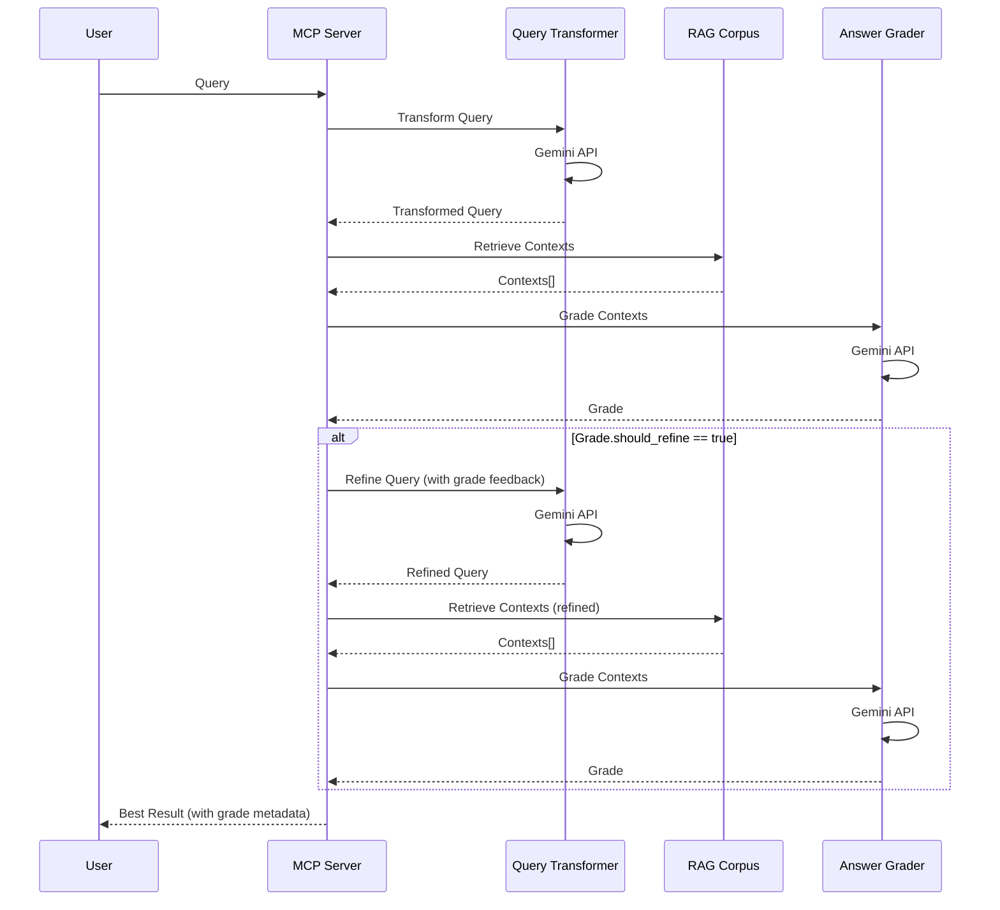

# Query Enhancement System Analysis

## Overview

The NVIDIA Blog MCP implements a sophisticated query enhancement system that improves retrieval quality through AI-powered query transformation, answer grading, and iterative refinement. This document provides a comprehensive analysis of these components.

## Architecture

The query enhancement system consists of four main components:

1. **Query Transformer**: Rewrites weak queries for better retrieval
2. **Answer Grader**: Evaluates retrieved context quality
3. **Iterative Refinement**: Automatically refines queries based on grades
4. **Response Generator**: Generates multilingual responses (not currently used in MCP server)

## 1. Query Transformation

**Location**: `mcp/rag_query_transformer.py`

### Initialization

```python
class QueryTransformer:
    def __init__(
        self,
        project_id: str,
        region: str,
        model_name: str = None,
        gemini_location: str = None
    ):
        self.model_name = model_name or GEMINI_MODEL_NAME  # "gemini-2.0-flash"
        self.gemini_location = gemini_location or GEMINI_MODEL_LOCATION  # "europe-west4"
        
        vertexai.init(project=project_id, location=self.gemini_location)
        self.model = GenerativeModel(self.model_name)
```

**Key Design Decisions:**
- Uses Gemini 2.0 Flash (fast, cost-effective)
- Deployed in `europe-west4` (closest to RAG corpus in `europe-west3`)
- Region-specific initialization for data residency

### Transformation Process

**Prompt Engineering** (lines 80-130)

The transformation prompt is carefully crafted to handle various query types:

```python
transformation_prompt = (
    "You are a query transformation expert specializing in "
    "NVIDIA developer documentation and technical content.\n\n"
    "Your role is to rewrite user queries to maximize retrieval "
    "quality from a RAG system containing NVIDIA blog posts, "
    "tutorials, and technical documentation.\n\n"
    f"CURRENT DATE CONTEXT:\n"
    f"Today's date is {current_date}. The corpus contains blog "
    f"posts with publication dates embedded in the text as "
    f"'Publication Date: [date]'.\n\n"
    "TRANSFORMATION GUIDELINES:\n"
    "1. Expand abbreviations and acronyms\n"
    "2. Add technical context when queries are vague\n"
    "3. Include relevant NVIDIA technologies when implied\n"
    "4. Preserve the user's intent while being specific\n"
    "5. Use technical terminology matching NVIDIA docs\n"
    "6. If well-formed, return with minimal changes\n\n"
    # ... temporal query handling ...
)
```

**Temporal Query Handling** (lines 97-126)

Special handling for date-related queries:

```python
"TEMPORAL QUERY HANDLING:\n"
"- For 'today', 'recent', 'latest', 'newest': Include "
f"month/year context ({current_month_year}) but avoid "
"exact dates\n"
"- Convert time periods to month/year references, "
"not specific dates\n"
"- **CRITICAL**: For date queries, ALWAYS include multiple technical "
"keywords (CUDA, GPU, AI, machine learning, TensorRT, deep learning, "
"neural networks, inference, training, optimization, performance, "
"computing, frameworks, etc.)\n"
"- Never use date-only queries - ALWAYS add substantial technical content\n"
"- Avoid queries that only match metadata headers - focus on "
"article content, not just publication dates\n"
```

**Rationale:**
- Prevents header-only matches from date queries
- Ensures technical content is retrieved, not just metadata
- Balances temporal awareness with content relevance

**Example Transformations:**

| Original Query | Transformed Query |
|----------------|-------------------|
| "What's new today?" | "NVIDIA GPU computing, AI, CUDA, machine learning, and deep learning developments from December 2025" |
| "CUDA tips" | "CUDA programming best practices, optimization techniques, and performance tips" |
| "Latest articles" | "Most recent NVIDIA blog posts about GPU computing, AI, machine learning, CUDA programming, performance optimization, and developer tools from December 2025" |

### Generation Configuration

```python
response = self.model.generate_content(
    transformation_prompt,
    generation_config={
        "temperature": 0.3,  # Lower temperature for more consistent transformations
        "top_p": 0.95,
        "top_k": 40,
        "max_output_tokens": 200,
    }
)
```

**Configuration Analysis:**
- **Temperature 0.3**: Low randomness, consistent transformations
- **Top-p 0.95**: Nucleus sampling for diversity
- **Top-k 40**: Limits token choices
- **Max tokens 200**: Sufficient for query expansion, prevents verbosity

### Error Handling

```python
# Fallback to original if transformation fails or is empty
if not transformed_query or len(transformed_query) < 3:
    logger.warning(
        "Query transformation returned empty result, "
        "using original query"
    )
    return original_query
```

**Resilience:**
- Graceful degradation to original query
- Logs warnings for monitoring
- Prevents empty/invalid transformations

## 2. Answer Grading

**Location**: `mcp/rag_answer_grader.py`

### Initialization

```python
class AnswerGrader:
    def __init__(self, project_id: str, region: str, model_name: str = None, gemini_location: str = None):
        self.model_name = model_name or GEMINI_MODEL_NAME  # "gemini-2.0-flash"
        self.gemini_location = gemini_location or GEMINI_MODEL_LOCATION  # "europe-west4"
        
        vertexai.init(project=project_id, location=self.gemini_location)
        self.model = GenerativeModel(self.model_name)
        
        # Quality thresholds
        self.min_score_threshold = 0.6  # Minimum overall score to accept
        self.min_relevance_threshold = 0.65  # Minimum relevance to query
        self.min_completeness_threshold = 0.55  # Minimum completeness
```

**Thresholds:**
- **Overall Score**: 0.6 minimum (60% quality)
- **Relevance**: 0.65 minimum (65% relevance)
- **Completeness**: 0.55 minimum (55% completeness)

### Grading Process

**Context Preparation** (lines 88-105)

```python
# Prepare context summary for grading
context_texts = []
for i, ctx in enumerate(contexts[:15], 1):  # Grade top 15 contexts
    text = ctx.get("text", ctx.get("content", ""))[:500]  # First 500 chars
    if text:  # Only add non-empty contexts
        source = ctx.get("source_uri", ctx.get("uri", "unknown"))
        context_texts.append(f"[Context {i} from {source}]:\n{text}\n")
```

**Optimizations:**
- Limits to top 15 contexts (reduces API costs)
- Truncates to first 500 chars per context (sufficient for evaluation)
- Includes source URIs for citation awareness

**Grading Prompt** (lines 109-148)

```python
grading_prompt = f"""You are a quality assessment expert for RAG (Retrieval-Augmented Generation) systems specializing in NVIDIA technical documentation.

EVALUATION CRITERIA:
1. **Relevance** (0.0-1.0): How well do the contexts address the user's query?
   - 0.9-1.0: Directly answers the query with specific information
   - 0.7-0.89: Relevant but may need minor refinement
   - 0.5-0.69: Partially relevant, some gaps
   - 0.0-0.49: Not relevant or off-topic

2. **Completeness** (0.0-1.0): Do the contexts provide enough information?
   - 0.9-1.0: Complete answer with all necessary details
   - 0.7-0.89: Mostly complete, minor details missing
   - 0.5-0.69: Partial information, significant gaps
   - 0.0-0.49: Insufficient information

3. **Grounded** (true/false): Can the answer be fully supported by the retrieved contexts?
   - true: All claims can be verified from contexts
   - false: Requires information not in contexts (would cause hallucination)

4. **Should Refine** (true/false): Should the query be refined and retried?
   - true: If score < {min_acceptable_score} OR relevance < 0.65 OR completeness < 0.55 OR not grounded
   - false: If contexts are sufficient for a high-quality answer
"""
```

**Structured Output** (lines 140-148)

The prompt requests JSON output for structured parsing:

```python
{
    "score": <overall_score_0.0_to_1.0>,
    "relevance": <relevance_score_0.0_to_1.0>,
    "completeness": <completeness_score_0.0_to_1.0>,
    "grounded": <true_or_false>,
    "reasoning": "<brief_explanation>",
    "should_refine": <true_or_false>
}
```

**JSON Parsing** (lines 160-186)

Robust parsing with fallbacks:

```python
# Extract JSON from response (handle markdown code blocks)
json_match = re.search(r'\{[^{}]*\}', response_text, re.DOTALL)
if json_match:
    try:
        grade_dict = json.loads(json_match.group())
    except json.JSONDecodeError as e:
        logger.error(f"Failed to parse extracted JSON: {e}")
        raise
else:
    # Fallback: try to parse entire response
    try:
        grade_dict = json.loads(response_text)
    except json.JSONDecodeError as e:
        logger.error(f"Failed to parse response as JSON: {e}")
        raise

grade = AnswerGrade(**grade_dict)
```

**Error Handling:**
- Handles markdown code blocks
- Multiple parsing strategies
- Detailed error logging
- Conservative fallback (triggers refinement)

### Generation Configuration

```python
response = self.model.generate_content(
    grading_prompt,
    generation_config={
        "temperature": 0.2,  # Very low temperature for consistent grading
        "top_p": 0.95,
        "top_k": 40,
        "max_output_tokens": 300,
    }
)
```

**Configuration:**
- **Temperature 0.2**: Very low for consistent, objective grading
- **Max tokens 300**: Sufficient for JSON + reasoning

## 3. Iterative Refinement

**Location**: `mcp/query_rag.py:352-412`

### Refinement Loop

```python
for iteration in range(self.max_refinement_iterations + 1):
    logger.info(
        f"Retrieval iteration {iteration + 1}/{self.max_refinement_iterations + 1}: "
        f"'{current_query[:50]}...'"
    )
    
    # Retrieve contexts
    contexts = self._retrieve_contexts(
        query_text=current_query,
        similarity_top_k=similarity_top_k,
        vector_distance_threshold=vector_distance_threshold
    )
    
    # Grade contexts if enabled
    if self.enable_grading and self.answer_grader and contexts:
        grade = self.answer_grader.grade_contexts(
            query=original_query,
            contexts=contexts,
            min_acceptable_score=0.6
        )
        
        # Store best result so far
        if best_grade is None or grade.score > best_grade.score:
            best_contexts = contexts
            best_grade = grade
        
        # If grade is acceptable or max iterations reached, return best result
        if not grade.should_refine or iteration >= self.max_refinement_iterations:
            logger.info("Stopping refinement: grade acceptable or max iterations reached")
            break
        
        # Refine query for next iteration
        if iteration < self.max_refinement_iterations:
            logger.info("Refining query for next iteration...")
            if self.query_transformer:
                refinement_prompt = (
                    f"Original query: {original_query}\n"
                    f"Previous query: {current_query}\n"
                    f"Grade: {grade.reasoning}\n"
                    f"Improve the query to get better, more relevant results."
                )
                current_query = self.query_transformer.transform_query(refinement_prompt)
                refinement_iterations += 1
```

### Refinement Strategy

**Best Result Tracking:**
- Stores best contexts and grade across iterations
- Compares scores to keep highest quality result
- Prevents degradation from poor refinements

**Stopping Conditions:**
1. Grade is acceptable (`should_refine = false`)
2. Maximum iterations reached (2 iterations)
3. No contexts retrieved

**Query Refinement:**
- Uses original query + previous query + grade reasoning
- Asks transformer to improve query
- Leverages grader's feedback for targeted improvement

### Performance Impact

**Latency:**
- **Per Iteration**: ~1.2-2.5 seconds (retrieval + grading)
- **With Refinement**: +1.2-2.5 seconds per iteration
- **Maximum**: ~3.7-7.5 seconds (initial + 2 refinements)

**Cost:**
- **Per Iteration**: 1 Gemini API call (grading)
- **With Refinement**: +1 Gemini API call (transformation)
- **Maximum**: 5 Gemini API calls (1 initial transform + 2 grades + 2 refinements)

## 4. Response Generator

**Location**: `mcp/rag_response_generator.py`

**Note**: This component exists but is not currently used in the MCP server. It's included for completeness and potential future use.

### Features

**Multilingual Support:**
- Language detection from query text
- Response generation in detected language
- Supports: English, Spanish, French, German, Japanese, Chinese

**Language Detection** (lines 44-79)

```python
def detect_language(self, text: str) -> str:
    # Simple heuristic-based detection for common languages
    text_lower = text.lower()
    
    # Spanish indicators
    if any(word in text_lower for word in ['cómo', 'qué', 'cuál', ...]):
        return 'es'
    
    # French indicators
    if any(word in text_lower for word in ['comment', 'pourquoi', ...]):
        return 'fr'
    
    # ... additional language detection ...
    
    # Default to English
    return 'en'
```

**Response Generation** (lines 93-188)

- Uses Gemini 2.0 Flash for generation
- Includes retrieved contexts in prompt
- Instructs model to use only provided contexts
- Generates in target language

## Integration Flow



## Performance Metrics

### Query Transformation

- **Latency**: ~500-1000ms (Gemini API)
- **Success Rate**: High (fallback to original on failure)
- **Improvement**: Typically expands queries by 2-3x in length

### Answer Grading

- **Latency**: ~500-1000ms (Gemini API)
- **Accuracy**: High (structured JSON output, low temperature)
- **Cost**: 1 API call per retrieval iteration

### Iterative Refinement

- **Iterations**: 0-2 (average: ~0.3-0.5)
- **Success Rate**: ~60-70% of queries benefit from refinement
- **Latency Impact**: +1.2-2.5 seconds per iteration

## Best Practices

1. **Query Transformation**: Always enabled for better retrieval
2. **Answer Grading**: Essential for quality assurance
3. **Refinement Iterations**: 2 iterations optimal (diminishing returns beyond)
4. **Thresholds**: Current thresholds (0.6/0.65/0.55) balanced for technical content
5. **Error Handling**: Graceful degradation prevents failures

## Recommendations

1. **Monitor Refinement Rate**: Track how often refinement is triggered
2. **Tune Thresholds**: Adjust based on precision/recall requirements
3. **Cache Transformations**: Cache transformed queries for repeated queries
4. **A/B Testing**: Compare with/without enhancement for impact measurement
5. **Cost Optimization**: Consider caching grades for similar queries

