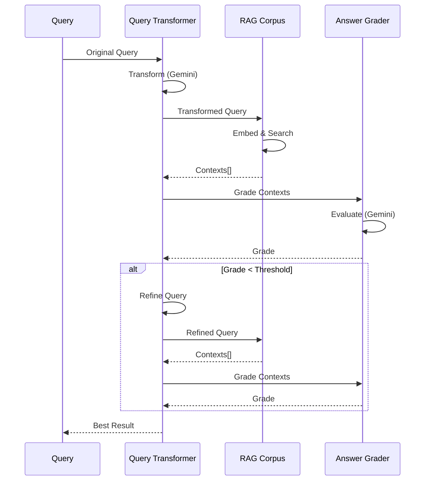

# RAG Pipeline Deep Dive

## Overview

The RAG (Retrieval-Augmented Generation) pipeline is the core of the NVIDIA Blog MCP system, enabling semantic search over NVIDIA's blog content. This document provides a comprehensive analysis of the RAG implementation, covering ingestion, retrieval, and integration with Vector Search.

## Architecture Components

### 1. RAG Corpus Ingestion

**Location**: `private/rag_ingest.py`

#### Initialization

```python
class RAGIngester:
    def __init__(self, rag_corpus_name: str, region: str, bucket_name: str):
        # Extract project ID and corpus ID from resource name
        # Format: projects/PROJECT/locations/REGION/ragCorpora/CORPUS_ID
        parts = rag_corpus_name.split('/')
        self.project_id = parts[1]
        self.corpus_id = parts[5]
        
        # Get credentials for API calls
        self.credentials, _ = default()
        
        # Base URL for RAG API
        self.base_url = f"https://{region}-aiplatform.googleapis.com/v1beta1"
```

**Key Design Decisions:**
- Uses REST API instead of Python SDK (SDK RAG module not available in vertexai 1.43.0)
- Extracts project/corpus IDs from resource name for flexibility
- Uses Google Auth default credentials (works with Cloud Run service accounts)

#### Ingestion Process

**Step 1: GCS URI Construction** (line 91)
```python
gcs_uri = f"gs://{self.bucket_name}/{folder}/clean/{item_id}.txt"
```
- References cleaned text files already stored in GCS
- Avoids re-uploading content
- Enables reprocessing without re-fetching

**Step 2: Chunking Configuration** (lines 106-109)
```python
"rag_file_chunking_config": {
    "chunk_size": 768,  # words (optimized for technical blog content)
    "chunk_overlap": 128  # words (~17% overlap for context preservation)
}
```

**Chunking Analysis:**
- **768 words**: Optimal for technical content (complete explanations, code examples)
- **128 words overlap**: ~17% ensures context continuity
- **Word-based**: More semantic than character-based chunking
- **Technical optimization**: Larger chunks than typical (512 words) due to technical content density

**Step 3: Import API Call** (lines 94-124)
```python
import_url = (
    f"{self.base_url}/projects/{self.project_id}/locations/{self.region}/"
    f"ragCorpora/{self.corpus_id}/ragFiles:import"
)

request_body = {
    "import_rag_files_config": {
        "gcs_source": {"uris": [gcs_uri]},
        "rag_file_chunking_config": {...}
    }
}
```

**API Characteristics:**
- Uses v1beta1 endpoint (latest RAG API)
- Supports batch import (single URI in this implementation)
- Returns Long Running Operation (LRO) for async processing

**Step 4: LRO Polling** (lines 154-219)
```python
max_poll_attempts = 120  # 10 minutes max (120 * 5 seconds)
poll_attempt = 0

while poll_attempt < max_poll_attempts:
    # Poll operation status
    op_result = op_response.json()
    
    if op_result.get("done", False):
        # Extract imported/skipped counts
        imported_count = response_data.get("imported_rag_files_count", 0)
        skipped_count = response_data.get("skipped_rag_files_count", 0)
        break
    
    time.sleep(5)  # Wait 5 seconds before polling again
```

**Polling Strategy:**
- **5-second intervals**: Balances responsiveness with API quota
- **120 attempts max**: 10-minute timeout prevents infinite loops
- **Progress logging**: Every minute (12 attempts) for visibility
- **Error handling**: Checks for operation errors in response

**Concurrent Operation Handling** (lines 54-64, 127-135)
```python
def _should_retry_on_concurrent_operation(self, response: requests.Response) -> bool:
    if response.status_code == 400:
        error_data = response.json()
        error_message = error_data.get("error", {}).get("message", "")
        if "other operations running" in error_message.lower():
            return True
    return False
```

**Retry Logic:**
- Detects concurrent operation conflicts (400 error with specific message)
- Uses tenacity decorator for exponential backoff (lines 66-70)
- Prevents race conditions in parallel ingestion

### 2. Query Retrieval

**Location**: `mcp/query_rag.py`

#### Initialization

```python
class RAGQuery:
    def __init__(
        self,
        rag_corpus_name: str,
        region: str,
        enable_transformation: bool = True,
        enable_grading: bool = True,
        max_refinement_iterations: int = 2
    ):
```

**Configuration Options:**
- **enable_transformation**: Query rewriting for better retrieval
- **enable_grading**: Quality evaluation and refinement
- **max_refinement_iterations**: Up to 2 query refinement attempts

#### Context Retrieval

**API Endpoint** (lines 116-119)
```python
retrieve_url = (
    f"{self.base_url}/projects/{self.project_id}/"
    f"locations/{self.region}:retrieveContexts"
)
```

**Request Structure** (lines 122-133)
```python
request_body = {
    "vertex_rag_store": {
        "rag_resources": {
            "rag_corpus": self.rag_corpus_name
        },
        "vector_distance_threshold": vector_distance_threshold  # Default: 0.7
    },
    "query": {
        "text": query_text,
        "similarity_top_k": similarity_top_k  # Default: 10
    }
}
```

**Key Parameters:**
- **vector_distance_threshold**: 0.7 (from config) - filters low-similarity results
- **similarity_top_k**: Number of contexts to retrieve (default: 10, max: 25)

#### Response Processing

**Field Normalization** (lines 176-245)

The API response structure can vary, so the code handles multiple formats:

```python
# Try the expected structure first: contexts.contexts[]
contexts = result.get("contexts", {}).get("contexts", [])

# Fallback: if contexts is directly a list
if not contexts and isinstance(result.get("contexts"), list):
    contexts = result.get("contexts", [])

# Handle chunk wrapping
if contexts and isinstance(contexts[0], dict) and "chunk" in contexts[0]:
    contexts = [ctx.get("chunk", ctx) for ctx in contexts]
```

**Text Extraction** (lines 194-244)

Handles multiple possible text field locations:

```python
# Attempt 1: Direct 'text' field
if ctx.get("text"):
    text = ctx.get("text")
# Attempt 2: Direct 'content' field
elif ctx.get("content"):
    text = ctx.get("content")
# Attempt 3: Nested chunk.text
elif isinstance(ctx.get("chunk"), dict) and ctx.get("chunk", {}).get("text"):
    text = ctx.get("chunk", {}).get("text")
# ... additional fallbacks
```

**Robustness Features:**
- Handles API response variations
- Multiple fallback strategies
- Detailed debug logging for troubleshooting
- Prevents failures from API changes

**Content Filtering** (lines 247-291)

Filters out low-quality chunks:

```python
# Remove metadata headers to check actual content
content_without_header = text
content_without_header = re.sub(r'^Publication Date:.*?\n', '', ...)
content_without_header = re.sub(r'^Title:.*?\n', '', ...)
content_without_header = re.sub(r'^Source:.*?\n', '', ...)
content_without_header = re.sub(r'^---\s*$', '', ...)
content_without_header = content_without_header.strip()

# Keep chunk if it has substantial content (>= 100 chars)
if len(content_without_header) >= 100:
    filtered_contexts.append(ctx)
```

**Filtering Benefits:**
- Removes header-only chunks (common with date queries)
- Ensures retrieved contexts contain actual article content
- Improves answer quality
- Prevents false positives

### 3. Vector Search Integration

**Location**: `mcp/query_vector_search.py` and `private/vector_search_ingest.py`

#### Vector Search Query

**Initialization** (lines 18-78)
```python
class VectorSearchQuery:
    def __init__(
        self,
        endpoint_id: str,
        index_id: str,
        region: str,
        model: str = "text-multilingual-embedding-002"
    ):
        aiplatform.init(location=region)
        
        # Initialize index
        index_name = f"projects/{project}/locations/{region}/indexes/{index_id}"
        self.index = matching_engine.MatchingEngineIndex(index_name=index_name)
        
        # Initialize embedding model
        self.embedding_model = TextEmbeddingModel.from_pretrained(model)
        
        # Initialize endpoint
        endpoint_name = f"projects/{project}/locations/{region}/indexEndpoints/{endpoint_id}"
        self.endpoint = matching_engine.MatchingEngineIndexEndpoint(
            index_endpoint_name=endpoint_name
        )
        
        # Get deployed index ID
        self.deployed_index_id = deployed_indexes[0].id
```

**Architecture:**
- Uses Vertex AI Matching Engine SDK (not REST API)
- Separates index (data) from endpoint (query interface)
- Supports multiple deployed indexes per endpoint
- Uses first deployed index (typical single-index scenario)

#### Embedding Generation

**Query Embedding** (lines 80-100)
```python
def _embed_query(self, query_text: str) -> List[float]:
    embeddings = self.embedding_model.get_embeddings([query_text])
    if not embeddings or len(embeddings) == 0:
        raise ValueError("No embeddings returned from model")
    return embeddings[0].values  # 768 dimensions
```

**Model**: `text-multilingual-embedding-002`
- **Dimensions**: 768
- **Languages**: 50+ languages supported
- **API**: Vertex AI TextEmbeddingModel SDK

#### Vector Search Query

**Query Execution** (lines 102-157)
```python
def query(
    self,
    query_text: str,
    num_neighbors: int = 10
) -> Dict:
    # Generate query embedding
    query_embedding = self._embed_query(query_text)
    
    # Query the index using endpoint's find_neighbors method
    results = self.endpoint.find_neighbors(
        deployed_index_id=self.deployed_index_id,
        queries=[query_embedding],
        num_neighbors=num_neighbors
    )
    
    # Process results
    neighbors = []
    for neighbor in results[0]:
        neighbors.append({
            "datapoint_id": neighbor.id,
            "distance": neighbor.distance,
            "feature_vector": neighbor.feature_vector[:10]  # Preview first 10 dims
        })
```

**Key Features:**
- Uses endpoint's `find_neighbors` method (not index directly)
- Returns datapoint IDs and distance scores
- Includes feature vector preview (first 10 dimensions) for debugging
- Supports batch queries (single query in this implementation)

### 4. Embedding Model Analysis

**Model**: `text-multilingual-embedding-002`

#### Specifications

- **Provider**: Google Vertex AI
- **Dimensions**: 768
- **Languages**: 50+ languages
- **Use Cases**: Semantic search, similarity matching
- **Input**: Text strings (up to model's context limit)
- **Output**: 768-dimensional float vectors

#### Model Selection Rationale

**Why This Model:**
1. **Multilingual Support**: Single model handles all languages (no language detection needed)
2. **Technical Content**: Optimized for technical documentation
3. **Dimension Balance**: 768 dimensions provide good quality/speed balance
4. **Vertex AI Integration**: Native integration with RAG Corpus and Vector Search

#### Embedding Characteristics

**Vector Properties:**
- **Normalization**: Typically L2-normalized (cosine similarity)
- **Distance Metric**: Cosine distance (1 - cosine similarity)
- **Semantic Preservation**: Similar concepts map to nearby vectors
- **Cross-Language**: Same concept in different languages maps to similar vectors

**Performance:**
- **Latency**: ~200-500ms per embedding generation
- **Throughput**: Supports batch processing
- **Cost**: Vertex AI pricing per embedding request

### 5. Distance Thresholds

**Configuration**: `mcp/config.py:50`
```python
RAG_VECTOR_DISTANCE_THRESHOLD = float(os.getenv("RAG_VECTOR_DISTANCE_THRESHOLD", "0.7"))
```

#### Threshold Analysis

**Value: 0.7**
- **Meaning**: Maximum cosine distance (1 - cosine similarity)
- **Equivalent**: Minimum cosine similarity of 0.3
- **Interpretation**: Filters out results with < 30% similarity

**Impact:**
- **Precision**: Higher threshold = more precise results (fewer false positives)
- **Recall**: Lower threshold = more results (fewer false negatives)
- **Current Setting**: Balanced for technical content (0.7 is moderate)

**Typical Ranges:**
- **Very Strict**: 0.5-0.6 (high precision, low recall)
- **Balanced**: 0.7-0.8 (current: 0.7)
- **Lenient**: 0.8-0.9 (high recall, lower precision)

#### Usage in Queries

**RAG Corpus** (`mcp/query_rag.py:102`):
```python
vector_distance_threshold: float = RAG_VECTOR_DISTANCE_THRESHOLD
```

**Vector Search**: No explicit threshold (returns top-k neighbors regardless of distance)

## Integration Patterns

### Dual Search Strategy

The system supports two search methods:

1. **RAG Method** (default):
   - Returns full text chunks with context
   - Includes source URIs for citations
   - Filters by distance threshold
   - Best for answer generation

2. **Vector Method**:
   - Returns datapoint IDs and distances
   - No text content (requires separate lookup)
   - No distance filtering
   - Best for similarity matching

### Query Flow Integration



## Performance Characteristics

### Ingestion Performance

- **Per Article**: ~5-10 seconds (including HTML fetch, cleaning, embedding, ingestion)
- **Bottlenecks**: 
  - RAG import LRO polling (can take 1-5 minutes)
  - Embedding generation (~200-500ms per article)
- **Parallelization**: Limited by concurrent operation handling

### Query Performance

- **Latency Breakdown**:
  - Query transformation: ~500-1000ms (Gemini API)
  - Context retrieval: ~200-500ms (RAG API)
  - Answer grading: ~500-1000ms (Gemini API)
  - **Total**: ~1.2-2.5 seconds per query (without refinement)
  - **With Refinement**: +1.2-2.5 seconds per iteration (up to 2 iterations)

### Scalability

- **RAG Corpus**: Supports millions of chunks
- **Query Throughput**: Limited by Gemini API quotas
- **Concurrent Queries**: Cloud Run handles horizontal scaling
- **Index Updates**: Near-real-time (LRO completion time)

## Error Handling

### Ingestion Errors

- **Concurrent Operations**: Retry with exponential backoff
- **LRO Timeouts**: 10-minute max, fails gracefully
- **API Errors**: Logged and re-raised for job-level handling

### Query Errors

- **Empty Contexts**: Returns empty result, logs warning
- **API Failures**: Caught and returned as ErrorResult
- **Field Normalization**: Handles missing fields gracefully

## Best Practices

1. **Chunk Size**: 768 words optimal for technical content
2. **Overlap**: 17% (128 words) ensures context continuity
3. **Distance Threshold**: 0.7 balanced for precision/recall
4. **Top-K**: 10 contexts typically sufficient for answers
5. **Refinement**: Up to 2 iterations balances quality/time

## Recommendations

1. **Monitor Distance Threshold**: Track precision/recall metrics, adjust if needed
2. **Chunk Size Tuning**: Evaluate retrieval quality vs. chunk size
3. **Embedding Model**: Consider newer models as they become available
4. **Caching**: Cache embeddings for repeated queries
5. **Batch Processing**: Optimize embedding generation with batching

